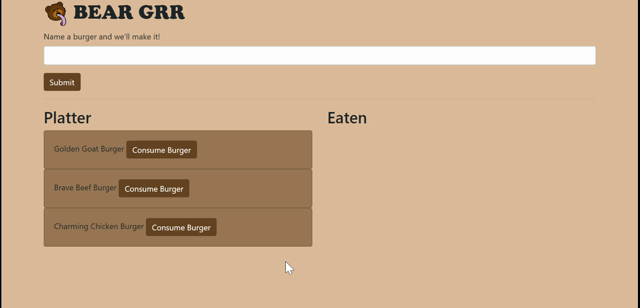

   

# Bear Grrr

1. [Description](#toc-desc)

2. [Installation](#toc-install)

3. [Usage](#toc-usage)

4. [License](#toc-license)

5. [Contributing](#toc-contrib)

6. [Tests](#toc-tests)

7. [Questions](#toc-contact)

## Description
Submit a burger of any name you want, and it will be added to your platter. You can consume the burgers on your platter. Your platter items and eaten items are listed in different columns.

## Installation
No installation required. Follow the Heroku link [here](https://polite-backbacon-18650.herokuapp.com/) to begin usage.

## Usage
Type in any name you wish in the text area. Submitting this will add the item to the left "Platter" list. Each Platter item can then be moved into the right "Eaten" list by selecting the "Consume Burger" button.

## License
[MIT](LICENSE)

## Contributing
Submit a pull request and the repository owner will review your changes.

## Tests
No tests.

## Questions

Please direct any questions, concerns, and compliments to [EddiEsteban](https://github.com/EddiEsteban)
 
